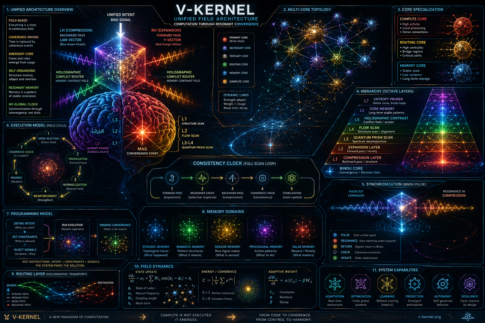
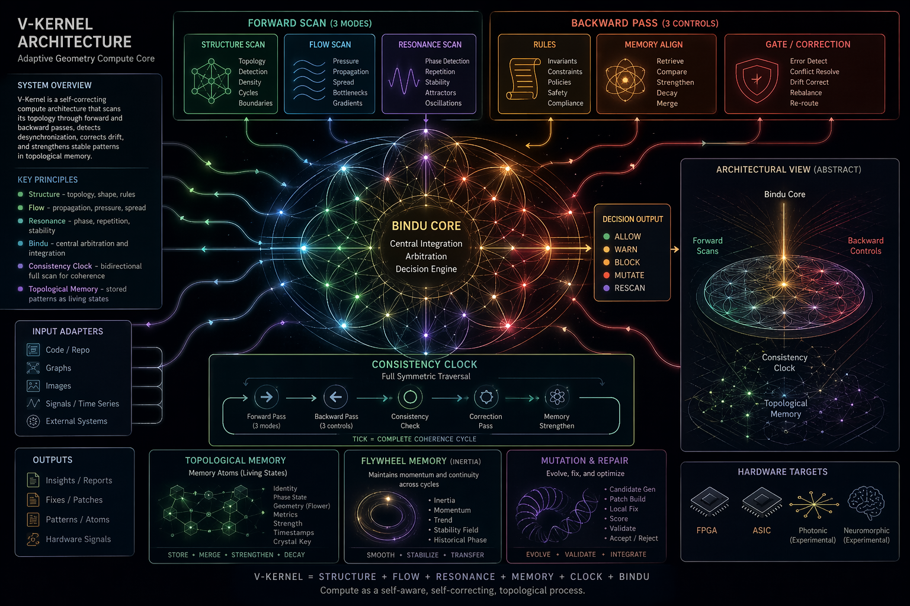

V-Kernel

Adaptive Geometry Compute Core

V-Kernel is a field-based computation architecture where:

«computation emerges from interaction over a structured field»

---

Architecture Overview

"V-Kernel System" (vkernel_full_system.png)

V-Kernel operates as a self-organizing system where:

- computation emerges from interaction
- memory is distributed and dynamic
- synchronization is achieved through coherence, not clocks
- structure evolves through feedback and reinforcement

---

Overview

V-Kernel is a self-correcting compute architecture designed to process complex systems as dynamic topological fields.

Instead of:

input → instructions → output

it continuously performs:

scan → compare → correct → stabilize → remember

The system operates on:

- structure
- flow
- resonance
- memory

—not only code or tokens.

---

Core Idea

Most modern systems fail not at the function level, but at the architecture level.

V-Kernel treats any input (code, graph, signal, image) as a structured field:

- nodes → elements
- edges → relationships
- state → dynamic field
- stability → coherence over time

The system detects:

- structural breaks
- flow imbalance
- phase instability
- memory drift

---

Architecture Diagram

"V-Kernel Architecture" (architecture.png)

---

System Flow

structure → projections → candidate field → interaction → convergence → result

This is not execution.

This is stabilization.

---

7-Layer Adaptive Architecture

V-Kernel operates across 7 functional layers:

L1–L2 — Structure Layer

- topology detection
- boundary definition
- raw input processing

L3–L4 — Flow & Resonance

- signal propagation
- gradient detection
- pattern emergence

L5 — Bindu Core

- central integration
- coherence evaluation
- decision output

Outputs:

ALLOW / WARN / BLOCK / MUTATE

Bindu is not a controller.
It is a coherence detector.

---

L6–L7 — Memory & Output

- stable state storage
- pattern consolidation
- system identity

---

Consistency Clock

There is no linear clock.

The system uses a full-cycle coherence loop:

Forward → Backward → Check → Correct → Strengthen

---

Forward Pass

- scans system
- propagates state

Backward Pass

- validates against memory and rules

Consistency Check

- compares forward vs backward
- calculates system error

Correction

- stabilizes unstable regions

Strengthening

- reinforces stable patterns

---

Bindu Core (Convergence Event)

Bindu activates when:

forward_state ≈ backward_state

At this point:

- decisions are emitted
- mutations may occur
- memory is updated

---

Memory Model

Memory is not stored data.

It is stabilized structure.

Each memory unit:

- identity
- phase state
- geometry
- strength

Memory Types

- Core Memory → stable identity
- Working Memory → temporary states
- Historical Memory → accumulated patterns

---

Entropy Pruning

A built-in cleanup system:

- removes unstable states
- prunes unused structures
- prevents drift

Constraints:

- requires consistency validation
- cannot remove stable memory

---

Research Layer

This architecture is backed by a formal model:

field → projections → state → interaction → convergence → computation

See:

- ""research/RESONANCE_AI.md"" (research/RESONANCE_AI.md)

Key concepts:

- multi-projection perception
- wave-based interaction
- interference dynamics
- convergence to attractors (Bindu)

---

Simulations

Start here:

- ""simulation/vkernel_full_research_demo.ipynb"" (simulation/vkernel_full_research_demo.ipynb)
- ""simulation/vkernel_resonance_ai.ipynb"" (simulation/vkernel_resonance_ai.ipynb)
- ""simulation/vkernel_petal_modes.ipynb"" (simulation/vkernel_petal_modes.ipynb)

---

Hardware Perspective

This model maps naturally to:

- FPGA (control + phase logic)
- photonic systems (wave computation)
- neuromorphic systems (state fields)

---

Why This Matters

Traditional systems:

- execute instructions
- depend on external control
- fail silently

V-Kernel:

- observes itself
- detects instability
- corrects in real time
- reinforces stable structure

---

System Identity

V-Kernel defines:

- topology-aware computation
- feedback-driven architecture
- phase-based memory
- self-correcting loops
- convergence-based output

---

Summary

V-Kernel is not a program.

It is a system that maintains its own coherence.

Computation = stabilization of a dynamic field

---
