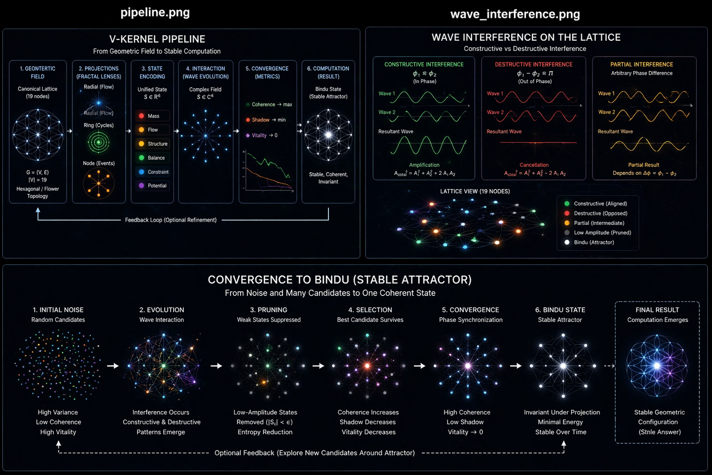

# Geometric Field Computation
## Figure 1 — V-Kernel Computation Pipeline

## A Multi-Projection Convergence Model (V-Kernel)

Author: Volodymyr Pozdnyak

---

## Abstract

This work introduces a field-based computational model where computation
emerges from interaction and convergence rather than instruction execution.

The system operates by projecting a canonical geometric field into multiple
representations, evolving these representations as a complex-valued system,
and selecting stable configurations through coherence-driven convergence.

---

1. Introduction

Modern computation is predominantly instruction-driven.

However, many natural systems do not operate through explicit instructions.
Instead, they evolve toward stable configurations through interaction.

This work introduces a field-based computational model where:

- structure precedes computation
- perception precedes execution
- stability defines the result

The model is derived from a geometric intuition and formalized into a reproducible system.

---

2. Origin of the Model (Geometric Intuition)

The model originates from observation of a canonical geometric lattice:

- hexagonal symmetry
- flower-like node arrangement (19 nodes)
- invariant spatial structure

Key observation:

The same geometric field can be perceived in multiple ways:

- radial (flow)
- ring (cycles)
- node (events)

Each perception extracts different information from the same structure.

This leads to the hypothesis:

Computation may emerge from combining multiple projections of a shared field.

---

3. From Perception to State Representation

To formalize perception, projection operators are introduced:

P_radial(G), P_ring(G), P_node(G)

These projections are mapped into a unified state space:

S ∈ ℝ^6

S = [mass, flow, structure, balance, constraint, potential]

This step converts geometry into a comparable and evolvable representation.

---

4. Extension to Wave-Based Representation

To model interaction dynamics, the state is extended to a complex field:

S ∈ ℂ^6

Each component:

S_k = A_k · exp(i φ_k)

Where:

- A_k = amplitude
- φ_k = phase

This enables:

- constructive interference
- destructive interference
- phase alignment

---

5. Interaction as Wave Interference

State evolution is defined as:

S_i(t+1) = Σ_j W_ij S_j(t)

This introduces:

- diffusion over graph
- interference between states
- local synchronization

Low-amplitude components are pruned:

|S_i| < ε → removed

---

6. Candidate Field Formulation

Instead of a single trajectory, the system maintains:

C = {S¹, S², ..., S^K}

Each candidate evolves independently.

This defines a parallel exploration of state space.

Candidates are evaluated via:

- coherence
- variance (shadow)
- dynamic change (vitality)

---

7. Convergence and Selection

The system selects:

S* = argmax(score(S^k))

Where:

score = α·coherence − β·variance − γ·vitality

This is interpreted as:

selection of the most stable configuration

---

8. Bindu State (Attractor)

The final state satisfies:

- phase synchronization
- minimal variance
- stability over time

This defines an attractor:

S → S*

The attractor is invariant under projection.

---

9. Computational Interpretation

Computation is defined as:

field → projections → state → interaction → convergence → stable configuration

There are no instructions.

The result is the most stable geometric structure.

---

10. Relation to Existing Fields

The model relates to:

- dynamical systems (attractors)
- graph signal processing
- phase synchronization (Kuramoto-type systems)
- ensemble methods
- variational optimization

---

11. Experimental Validation

Simulation demonstrates:

- initial noise
- interference patterns
- suppression of unstable states
- convergence to stable attractor

---

12. Discussion

The model suggests:

- computation can emerge from interaction, not control
- perception defines state space
- stability defines correctness

---

13. Conclusion

A new computation paradigm is proposed:

Computation as convergence in a structured field.

This bridges:

geometry → perception → state → dynamics → stability

---

## Related Documents

- REPRODUCTION_PATH.md — full pipeline
- WAVE_INTERFERENCE_MODEL.md — wave dynamics
- CANDIDATE_FIELD.md — multi-state exploration
- ---
